# Mobile client for the Computer components web-application 2

```
 _______  _____  _______  _____   _____  __   _ _______ __   _ _______ _______
 |       |     | |  |  | |_____] |     | | \  | |______ | \  |    |    |_____|
 |_____  |_____| |  |  | |       |_____| |  \_| |______ |  \_|    |    |     |
```

This is a mobile port of the [front-end](https://github.com/vadniks/ComputerComponentsWebApp2_front) 
part of the whole web app. The mobile app's logic is written entirely in [Dart](https://dart.dev) 
using [Flutter](https://flutter.dev) - the ULTIMATE UI framework for any platform.

App requires [Server](https://github.com/vadniks/ComputerComponentsWebApp2) in order to function properly.

## Features

- Native dark theme
- PC configurator
- Catalogue browser
- Configuration saver and price totalizer
- Logging in and out
- User sessions via encrypted cookies
- Order history tracking and viewing

## Screenshots

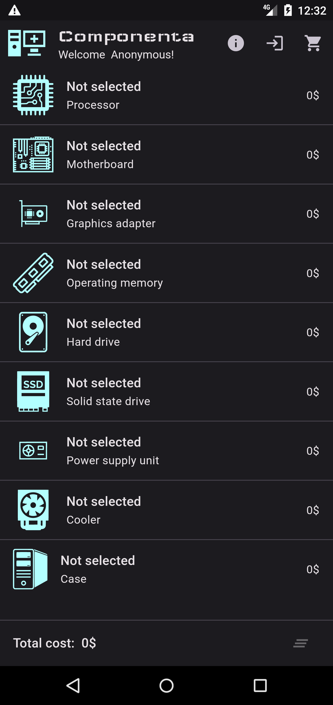
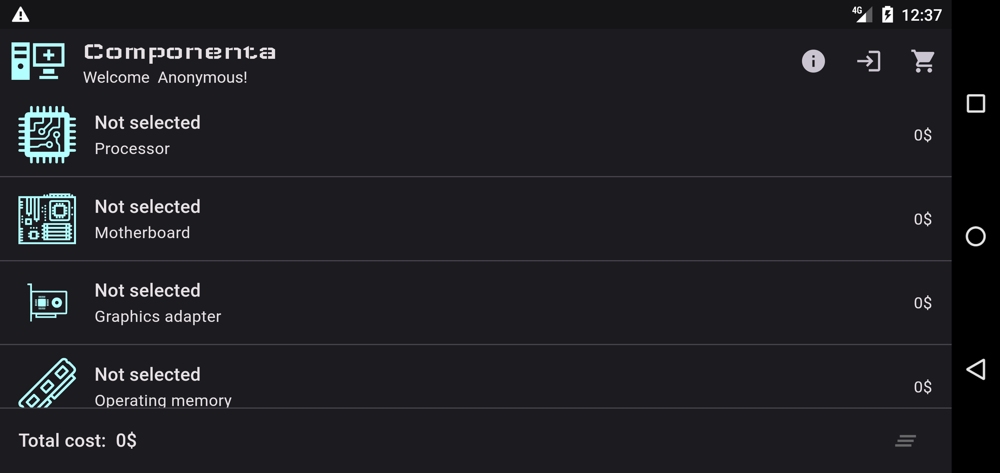
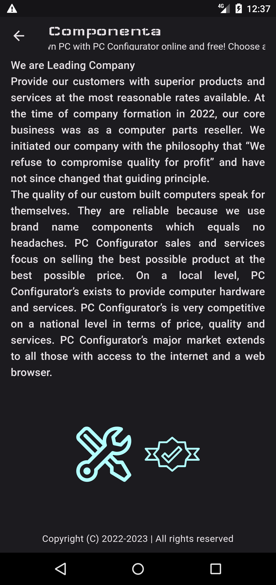
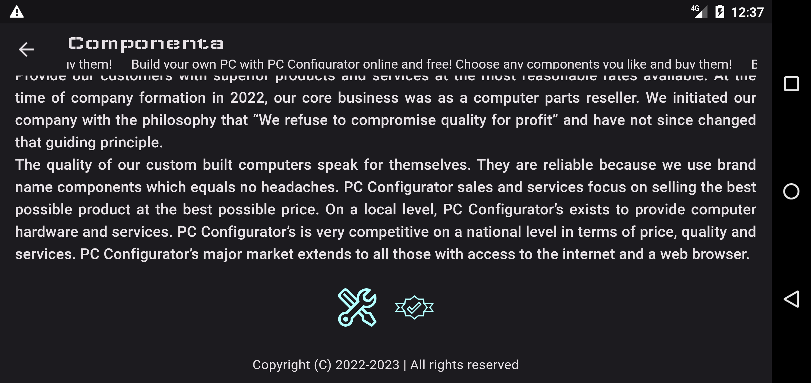
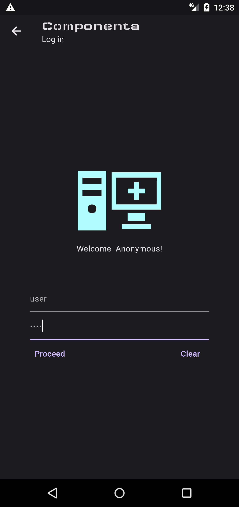
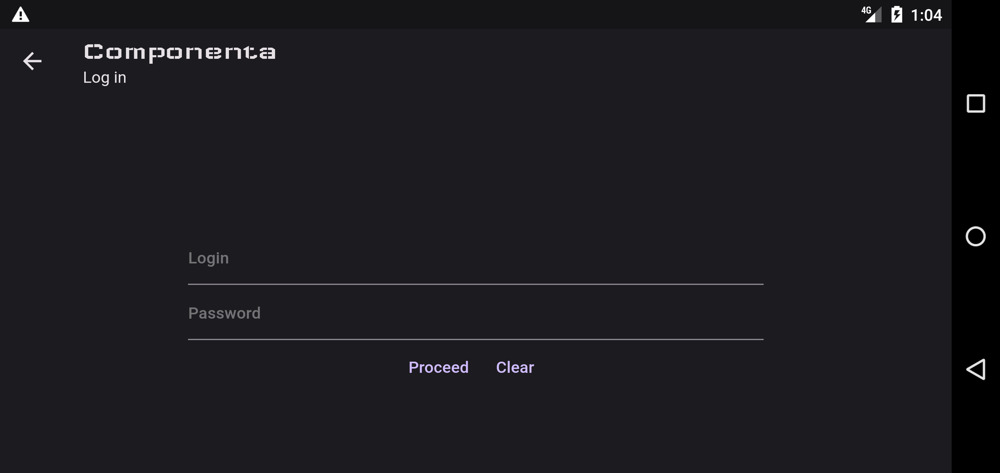
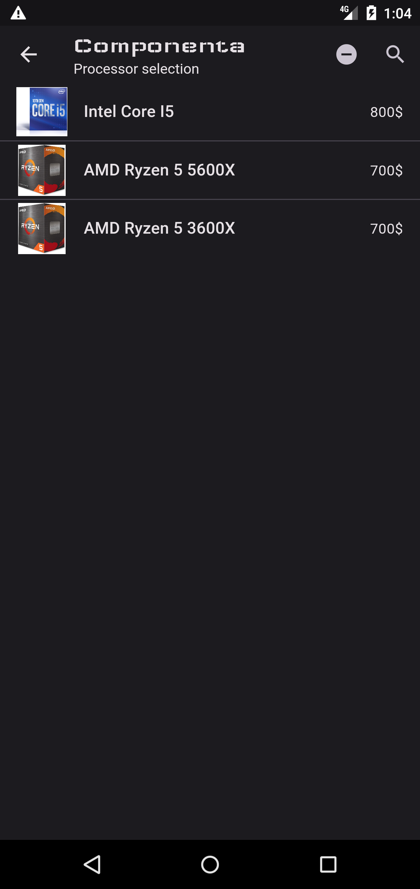
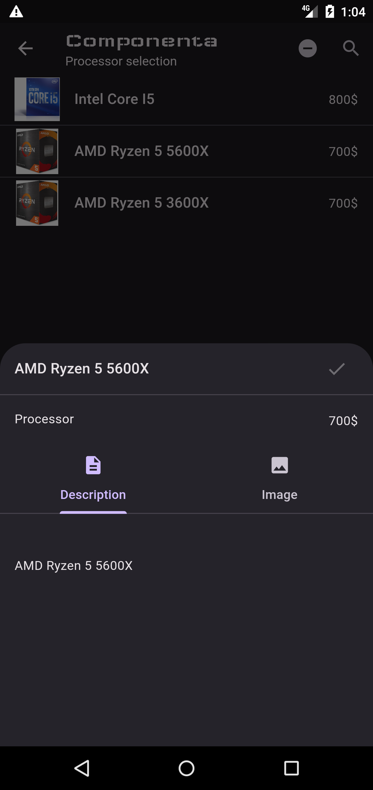
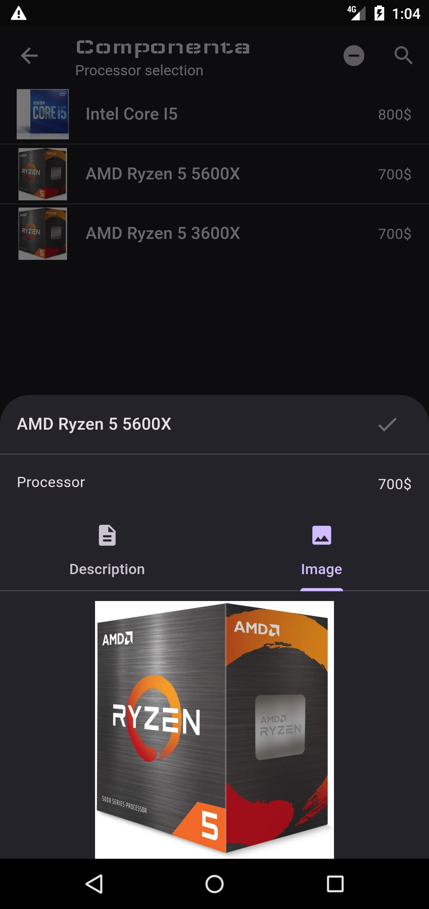
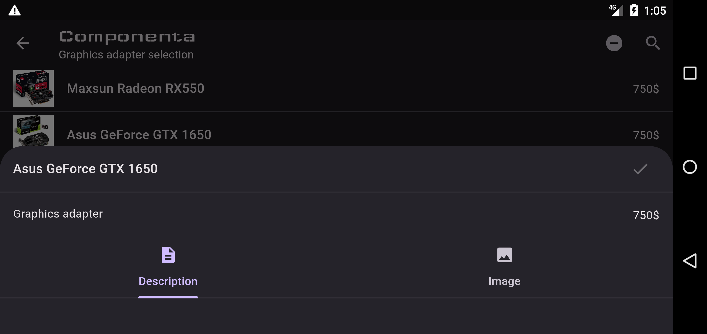
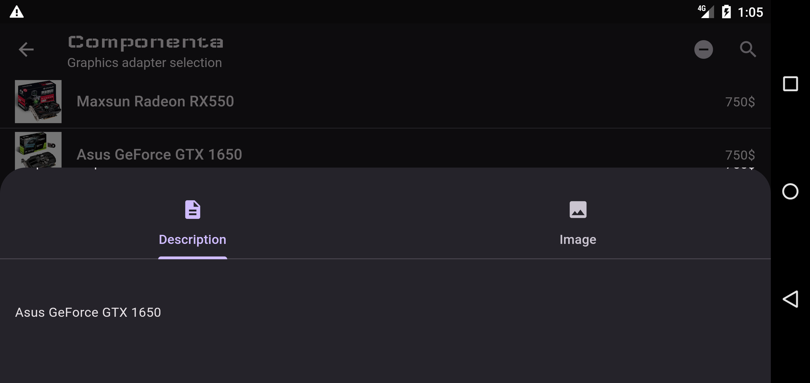
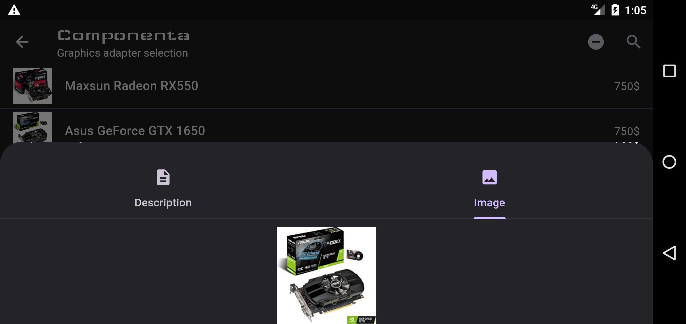
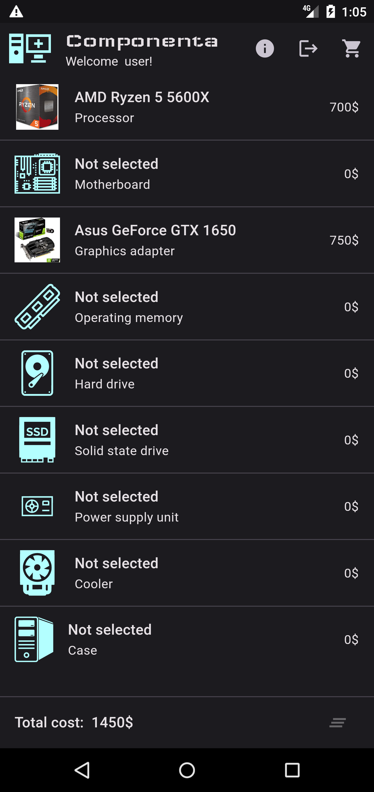
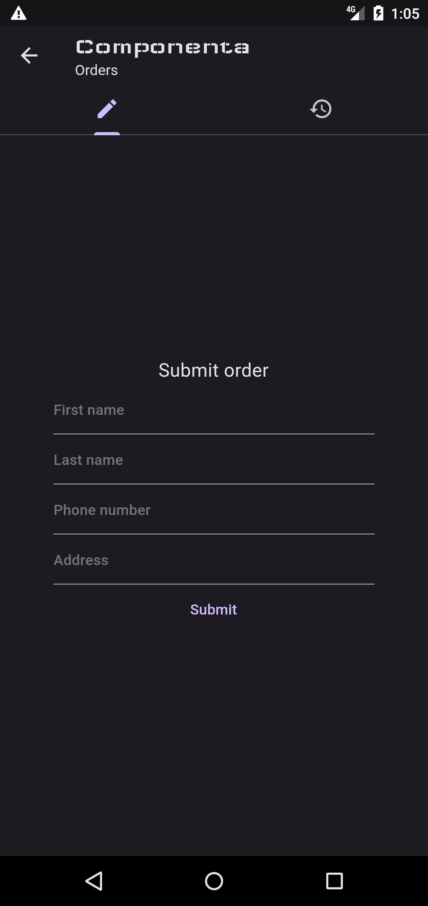
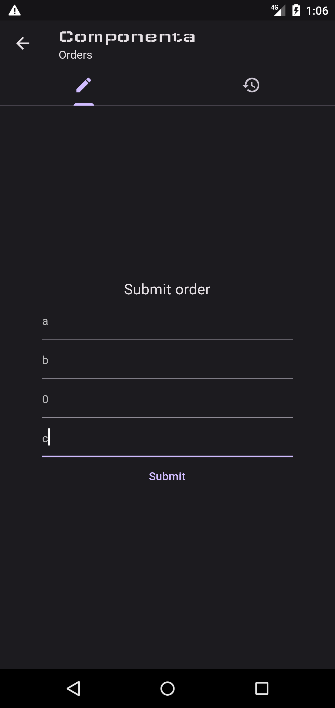
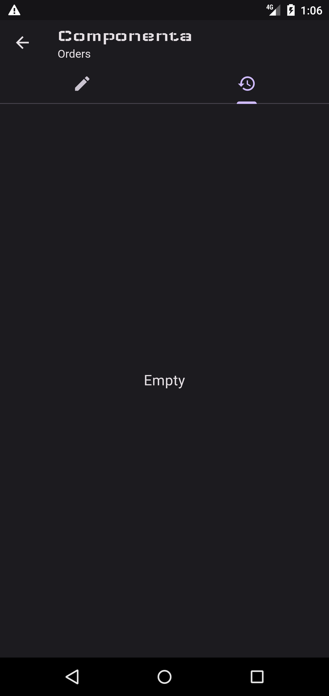
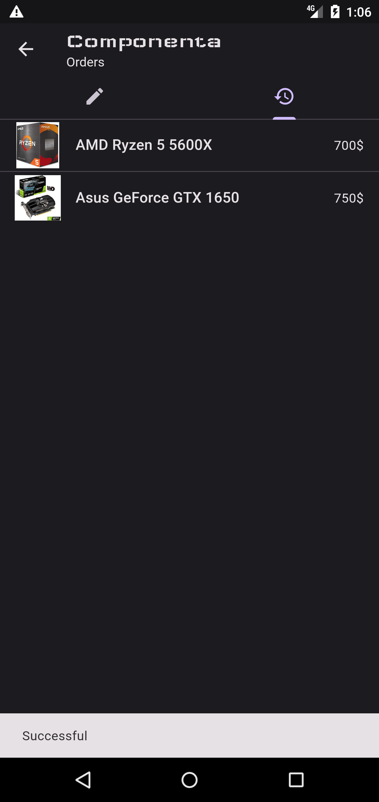
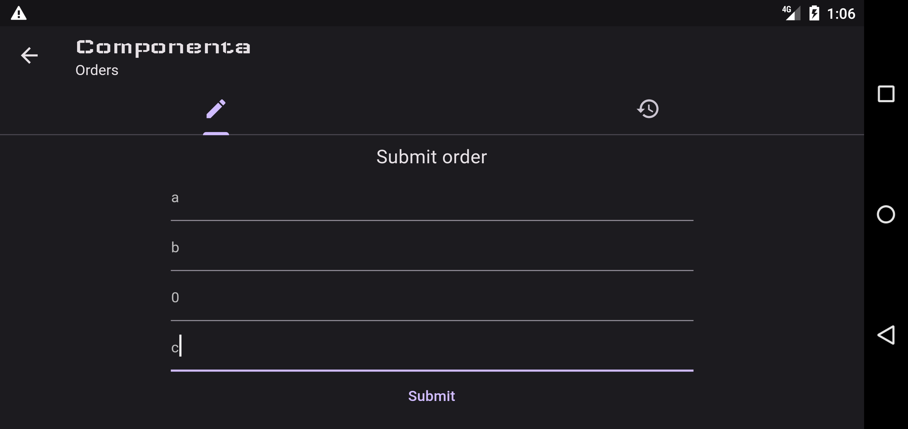
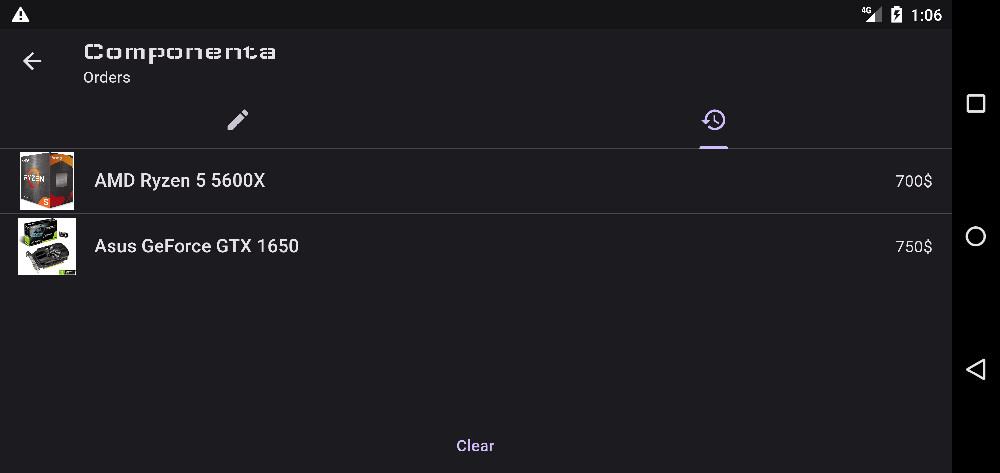
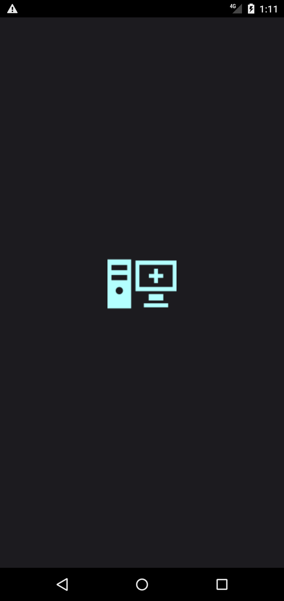
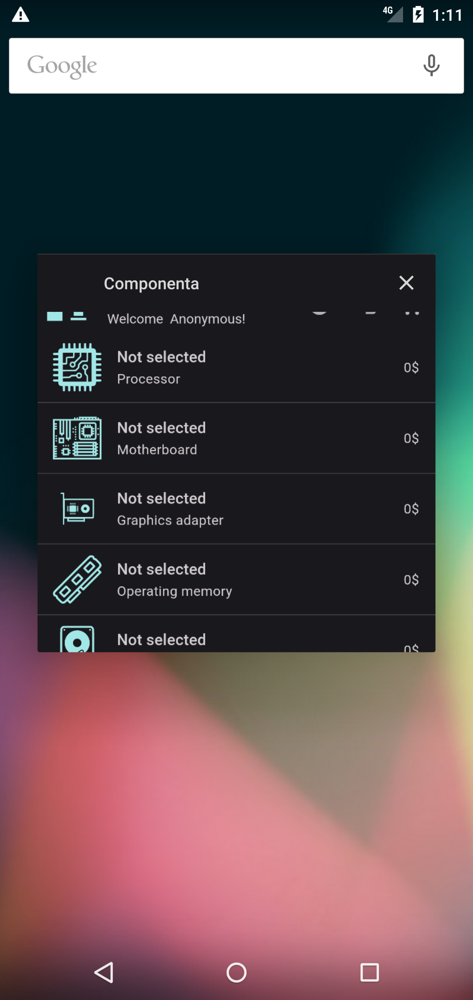
